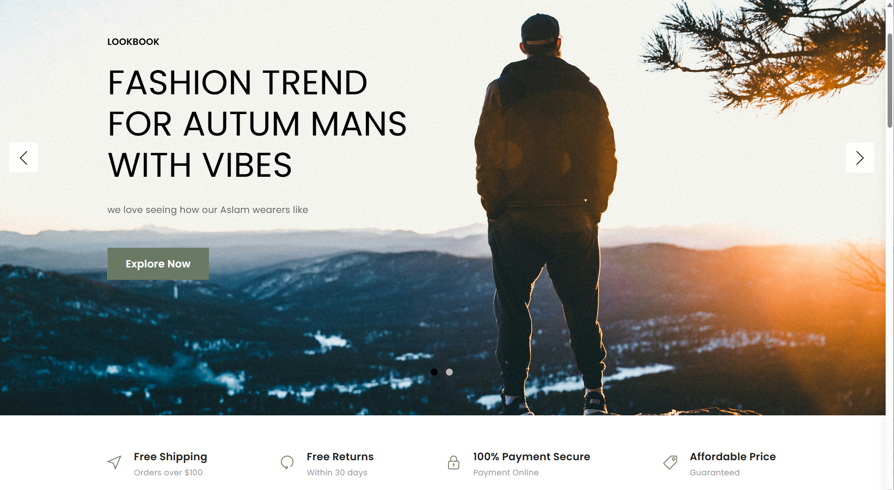
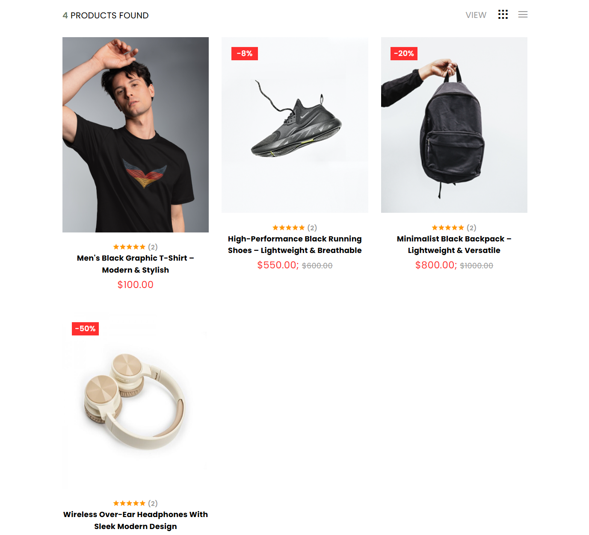
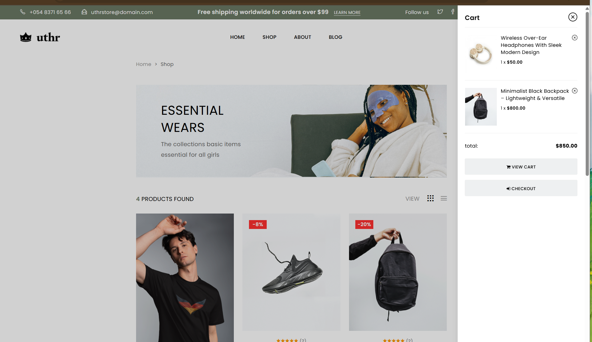
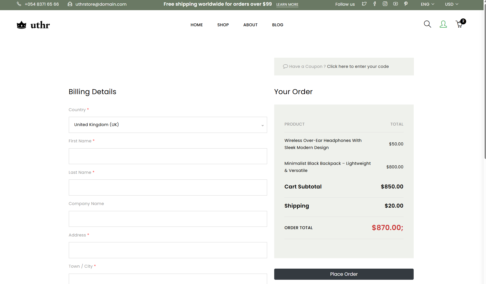
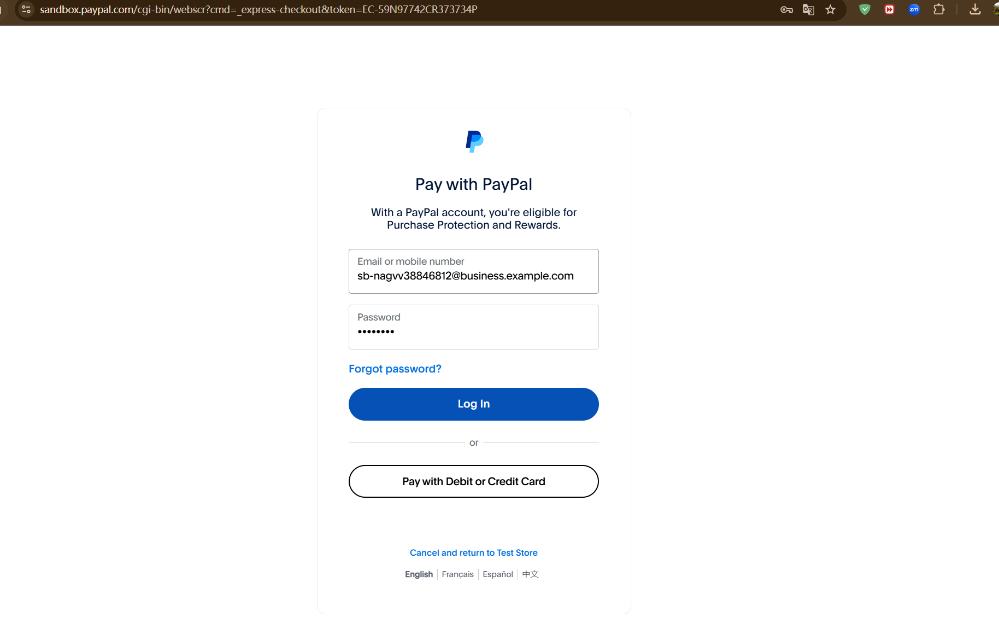
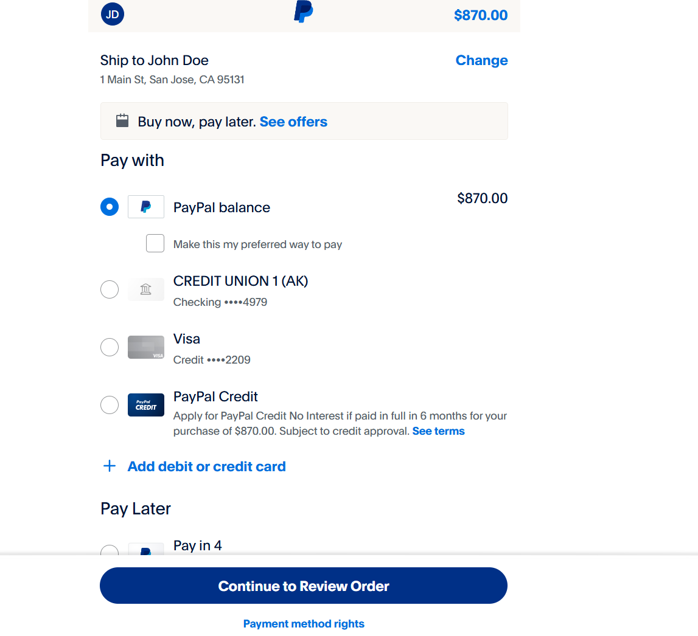
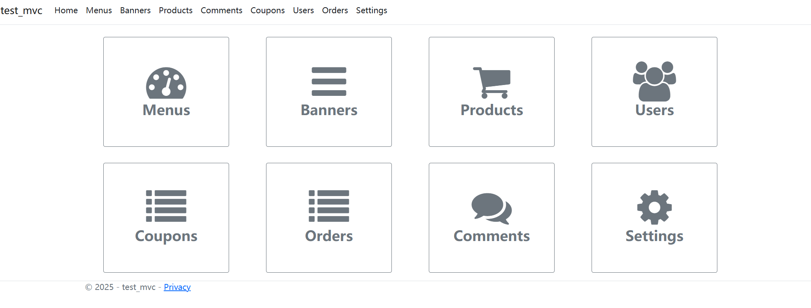
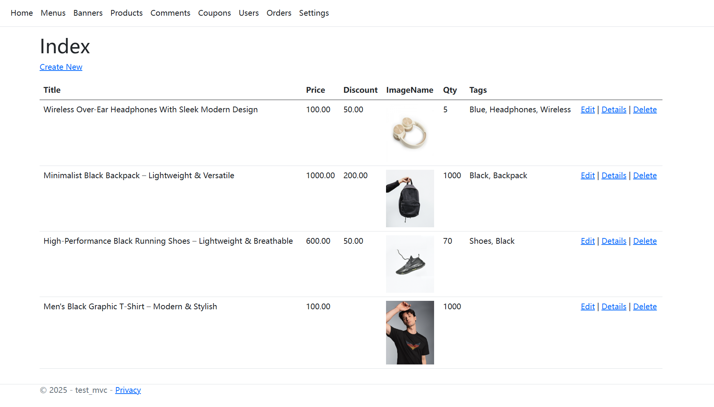

#  E-commerce Website

A fully functional **E-commerce Website** built with ASP.NET MVC.  
It supports product browsing, shopping cart, PayPal checkout, and admin management.

---
## Home Page

## Shop Page

## Cart Page

## Checkout Page

## Paypal Login

## Paypal Confirm

## Admin Dashboard

## Admin Product


---
## Features 
-  Product listing with list/grid switch
-  Product search and tag filtering
-  Add-to-cart, real-time cart, quantity update
-  PayPal sandbox integration for checkout
-  Admin panel to manage:
  - Products
  - Users
  - Orders
  - Coupons
  - Menus
  - Comments
-  Inventory and stock quantity display
-  Responsive layout with modern design
---
## Tech Stack
| Category       | Technology              |
|----------------|--------------------------|
| Frontend       | Bootstrap 5, jQuery, HTML/CSS |
| Backend        | ASP.NET MVC (.NET 6+)   |
| Database       | SQL Server / LocalDB    |
| ORM            | Entity Framework        |
| Payment        | PayPal Sandbox API      |
| Authentication | ASP.NET Identity        |

---
## Prerequisites
- Visual Studio 2022 or later
- .NET 6 SDK
- SQL Server (or LocalDB)
- PayPal Developer Sandbox Account
---
## Setup Steps 
1. **Clone the repo**

```bash
git clone https://github.com/yhe428/E-commerce-website.git
```
2. **Open the `.sln` file in Visual Studio**
3. **Update database config**
In `appsettings.json`, update the connection string if needed:

```json
"ConnectionStrings": {
  "DefaultConnection": "Server=(localdb)\\MSSQLLocalDB;Database=ShopDB;Trusted_Connection=True;"
}
```
4. **Update Paypal credentials**
```json
"PayPal": {
  "ClientId": "YourClientIdHere",
  "ClientSecret": "YourClientSecretHere",
  "Mode": "sandbox"
}
```
5. **Run the app
Press Ctrl + F5 or click IIS Express in Visual Studio to launch the web application.
---
## Paypal Integration 

This project uses Paypal Sandbox for testing payments. 
---
## Admin Access 

Email: yhe@163.com 
Password:123
